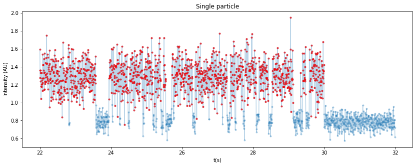
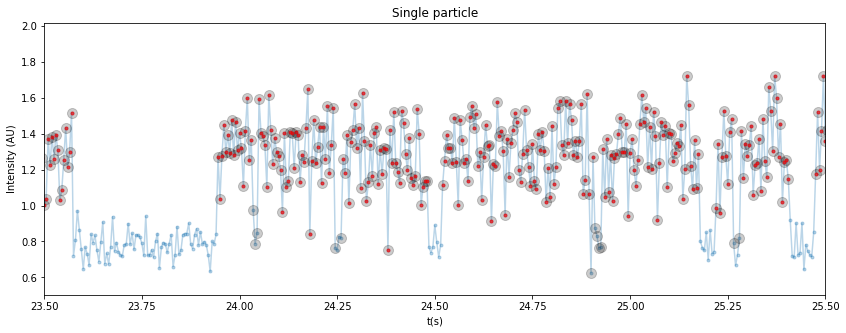

# Blinking-detector

## About

Neural network classifier for 1D traces that can be used to detect the on times of blinking traces.

The input is a given time trace with 2000 (time) points. 
Here, blue points are off-states and red points are on-states.

And the network output is a time series of 0 and 1s corresponding to either off and on-state respectively.

Zooming in:

